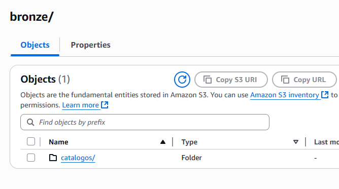
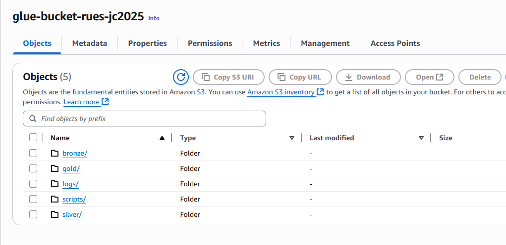
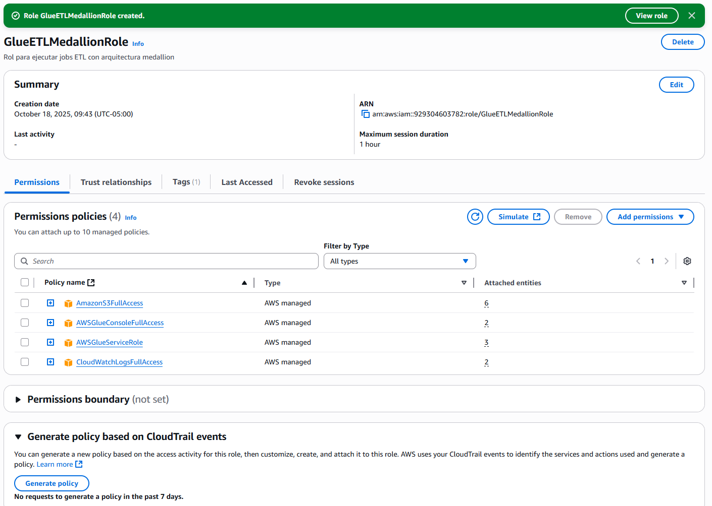
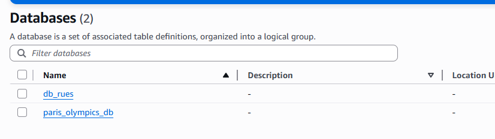

# Implementación ETL en AWS Glue con Arquitectura Medallion

## **FASE 1: PREPARACIÓN DEL ENTORNO AWS**

### Paso 1: Crear el bucket S3

1. Acceda al servicio **S3** en la consola de AWS

2. Haga clic en **Crear bucket**

3. Configure el bucket con los siguientes parámetros:

   - **Nombre del bucket:** `glue-bucket-rues-{codigo}`
     - Reemplace `{codigo}` con un identificador único (ej: sus iniciales + 4 dígitos)
     - Ejemplo: `glue-bucket-rues-jcj2025`
   
   - **Región:** Seleccione `us-east-1` (Norte de Virginia)
   
   - **Etiquetas:** Agregue la siguiente etiqueta
     - Clave: `workshop`
     - Valor: `big_data`
   
   - Deje las demás opciones por defecto

4. Haga clic en **Crear bucket**




### Paso 2: Crear la estructura de carpetas

Dentro del bucket `glue-bucket-rues-{codigo}`, cree las siguientes carpetas:

```
bronze/
  ├── catalogos/
  └── rues_empresas_colombia_2025.csv
silver/
  └── datos-empresariales-clean/
gold/
  ├── fact_renovacion/
  └── dim_empresa/
scripts/
  └── temp/
logs/
  └── errors/
```


### Paso 3: Cargar archivos de catálogo

Cargue los siguientes archivos CSV en la carpeta `bronze/catalogos/`:

**Archivo: catalogo_clases_identificaciones.csv**
```csv
clase_identificacion,codigo
NIT,11
CEDULA DE CIUDADANIA,33
CEDULA DE EXTRANJERIA,44
PASAPORTE,55
TARJETA DE IDENTIDAD,66
PERMISO POR PROTECCION TEMPORAL,77
PERMISO ESPECIAL DE PERMANENCIA,88
REGISTRO CIVIL DE NACIMIENTO,99
DOCUMENTO EXTRANJERO,101
```

**Archivo: catalogo_codigos_ciuu.csv**
```csv
codigo,actividad
0111,Cultivo de cereales (excepto arroz) legumbres y semillas oleaginosas
0112,Cultivo de arroz
4511,Comercio de vehículos automotores nuevos
6910,Actividades jurídicas
6920,Actividades de contabilidad teneduría de libros auditoría financiera y asesoría tributaria
```

### Paso 4: Cargar dataset principal

Cargue su archivo de datos empresariales en la carpeta `bronze/datos-empresariales/`
Este archivo puede demorarse, aproximadamente 20 minutos en cargar, por lo que es 
importante realizarlo con tiempo.


## **FASE 2: CONFIGURACIÓN DE IAM**

### Paso 5: Crear el rol de IAM para Glue

1. Acceda al servicio **IAM**

2. Seleccione **Roles** en el menú lateral

3. Haga clic en **Crear rol**

4. Configure el rol:

   **Tipo de entidad de confianza:**
   - Seleccione: **Servicio de AWS**
   - Caso de uso: **Glue**
   - Haga clic en **Siguiente**

   **Agregar permisos:**
   
   Adjunte las siguientes políticas administradas:
   - `AWSGlueServiceRole`
   - `AmazonS3FullAccess`
   - `CloudWatchLogsFullAccess`
   - `AWSGlueConsoleFullAccess`
   
   Haga clic en **Siguiente**

   **Detalles del rol:**
   - Nombre del rol: `GlueETLMedallionRole`
   - Descripción: `Rol para ejecutar jobs ETL con arquitectura medallion`
   
   **Etiquetas:**
   - Clave: `workshop`
   - Valor: `big_data`

5. Haga clic en **Crear rol**




6. Anote el ARN del rol creado para referencia futura


## **FASE 3: CONFIGURACIÓN DE GLUE DATA CATALOG**

### Paso 6: Crear la base de datos en Glue Catalog

1. Acceda al servicio **AWS Glue**

2. En el menú lateral, seleccione **Data Catalog** > **Databases**

3. Haga clic en **Add database**

4. Configure la base de datos:
   - **Nombre:** `db_rues`
   - **Descripción:** `Base de datos para arquitectura medallion - procesamiento ETL empresas`
   - **Etiquetas:**
     - Clave: `workshop`
     - Valor: `big_data`

5. Haga clic en **Create database**


