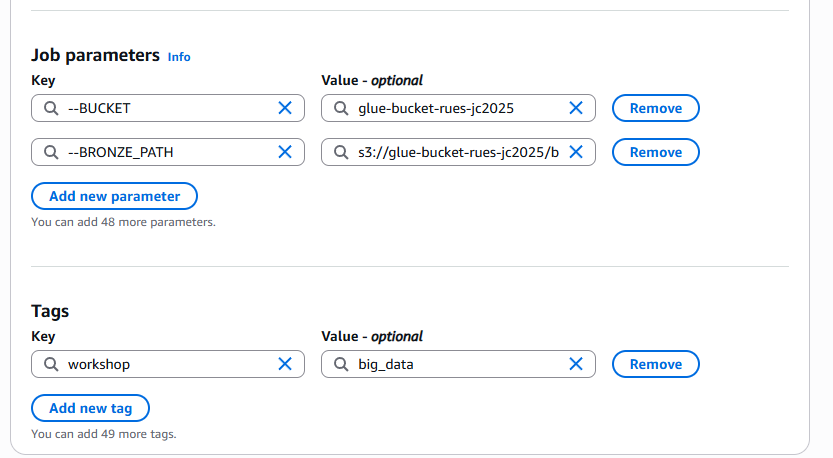
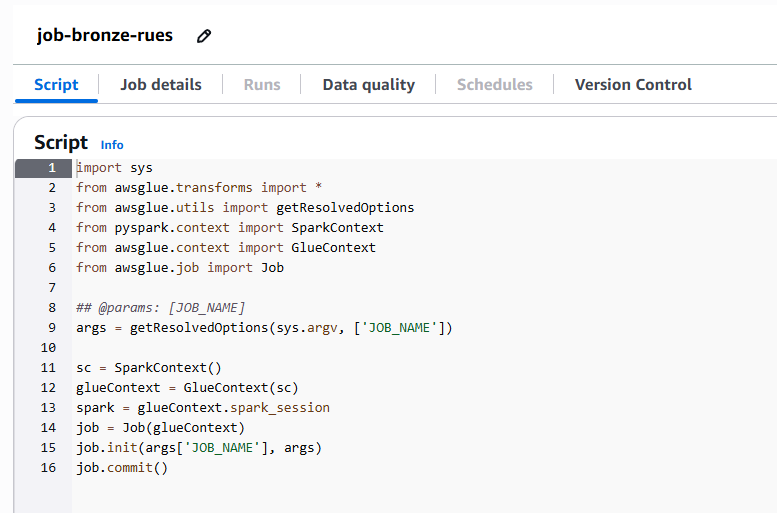
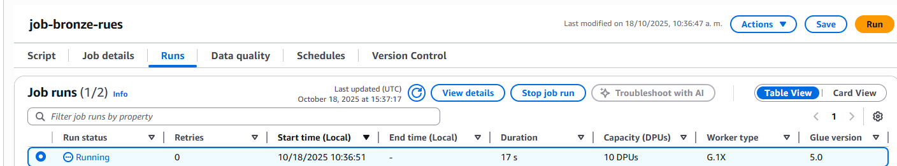

# JOB BRONZE - Carga de Datos Empresariales

## Paso 1: Crear el Job de Glue para Bronze

1. Acceda al servicio **AWS Glue**

2. En el menú lateral, seleccione **ETL Jobs**

3. Haga clic en **Script editor**

4. Configure:
   - **Motor:** Spark
   - **Opciones:** Start fresh
   - Haga clic en **Create**

## Paso 2: Configurar los detalles del Job

En la pestaña **Job details**, configure los siguientes parámetros:

**Información básica:**
- **Nombre:** `job-bronze-empresas`
- **Rol de IAM:** `GlueETLMedallionRole`
- **Tipo:** Spark
- **Versión de Glue:** 5.0
- **Lenguaje:** Python 3

**Configuración de recursos:**
- **Tipo de worker:** G.1X
- **Número de workers:** 10
- **Tiempo de espera del trabajo:** 480 minutos

**Configuración avanzada:**
- **Ruta del script:** `s3://glue-bucket-rues-{codigo}/scripts/job-bronze-empresas.py`
- **Directorio temporal:** `s3://glue-bucket-rues-{codigo}/scripts/temp/`

## Paso 3: Agregar parámetros del Job

En la sección **Job parameters**, agregue los siguientes parámetros:

| Clave | Valor |
|-------|-------|
| `--BUCKET` | `glue-bucket-rues-{codigo}` |
| `--BRONZE_PATH` | `s3://glue-bucket-rues-{codigo}/bronze/` |

**Nota:** Reemplace `{codigo}` con su identificador único (ejemplo: `jc2025`)

## Paso 4: Agregar etiquetas

En la sección **Tags**, agregue:
- **Clave:** `workshop`
- **Valor:** `big_data`

## Paso 5: Guardar la configuración

Haga clic en **Save** para guardar la configuración del Job.

