# JOB SILVER - Aplicación de Reglas de Negocio

## Reglas de Negocio

| Nº | Regla de Negocio | Descripción | Detalles de Implementación |
|----|------------------|-------------|----------------------------|
| **RN-001** | **Estandarización de Fechas** | Convertir todas las fechas (`fecha_matricula`, `fecha_renovacion`, `fecha_actualizacion`) al formato YYYY-MM-DD | • Formato objetivo: ISO 8601 • Valores no convertibles → Log de errores |
| **RN-002** | **Limpieza de Registros Duplicados** | Identificar duplicados basados en `matricula` y `nit`, conservando solo el más reciente | • Ordenar por `fecha_actualizacion` descendente • Eliminar duplicados manteniendo el primero |
| **RN-003** | **Normalización de Estados** | Unificar valores inconsistentes en `estado_matricula` | • Convertir a mayúsculas • Eliminar espacios al inicio y final • Ejemplo: "activa", "ACTIVA", "Activa" → "ACTIVA" |
| **RN-004** | **Creación de Variables Derivadas** | Calcular `antiguedad_empresa` basado en la fecha de matrícula | • Fórmula: `año_actual - año(fecha_matricula)` • Si fecha es NULL → Log de errores |
| **RN-005** | **Enriquecimiento de Actividad Económica** | Crear columna `actividad_economica` mapeando `cod_ciuu_act_econ_pri` con el catálogo CIIU | • Join con catálogo por código • Códigos no encontrados → Log de errores |
| **RN-006** | **Creación de Llave Única** | Generar campo `id_unico` para identificación inequívoca | • Concatenar: `codigo_camara` + `matricula` + `razon_social` • Si falta algún valor → Log de errores |
| **RN-007** | **Gestión de Registros Inválidos** | No eliminar registros, solo reportar inconsistencias | • Exportar errores a CSV • Columnas del log: `columna`, `mensaje_error`, `valor` |
| **RN-008** | **Mapeo de Clase de Identificación** | Asignar código numérico según `clase_identificacion` | • Aplicar mapeo del catálogo 2.1 • "SIN IDENTIFICACION" o NULL → Log de errores |
| **RN-009** | **Determinación de Tipo de Persona** | Crear campo `tipo_persona` según el tipo de identificación | • Si `clase_identificacion` = "NIT" → tipo_persona = 2 (jurídica) • Otros casos → tipo_persona = 1 (natural) |
| **RN-010** | **Estandarización de Nombres de Columnas** | Convertir nombres de columnas a formato snake_case | • Convertir a minúsculas • Reemplazar espacios por guiones bajos • Ejemplo: "Fecha Matricula" → "fecha_matricula" |

## Parámetros del Job

El job de Silver recibirá los siguientes parámetros:

| Parámetro | Descripción | Ejemplo |
|-----------|-------------|---------|
| `--BUCKET` | Nombre del bucket S3 | `glue-bucket-rues-jc2025` |
| `--BRONZE_PATH` | Ruta de la capa Bronze | `s3://glue-bucket-rues-jc2025/bronze/` |
| `--SILVER_PATH` | Ruta de la capa Silver | `s3://glue-bucket-rues-jc2025/silver/` |
| `--CATALOGOS_PATH` | Ruta de los catálogos | `s3://glue-bucket-rues-jc2025/bronze/catalogos/` |
| `--LOGS_PATH` | Ruta para guardar logs de errores | `s3://glue-bucket-rues-jc2025/logs/` |

---

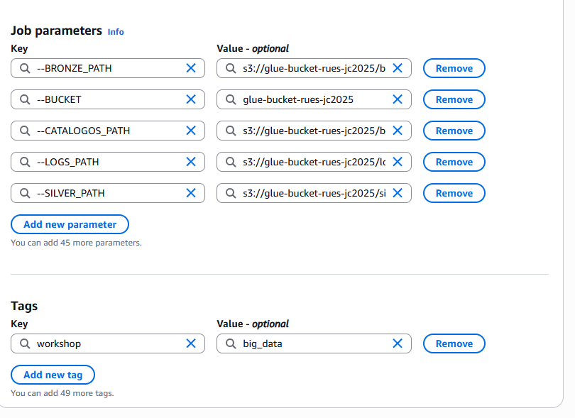

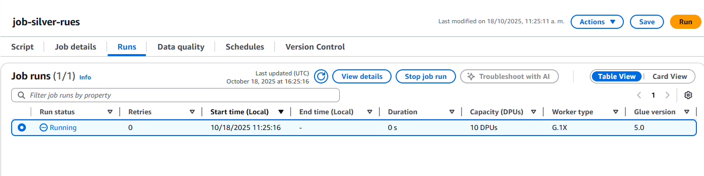

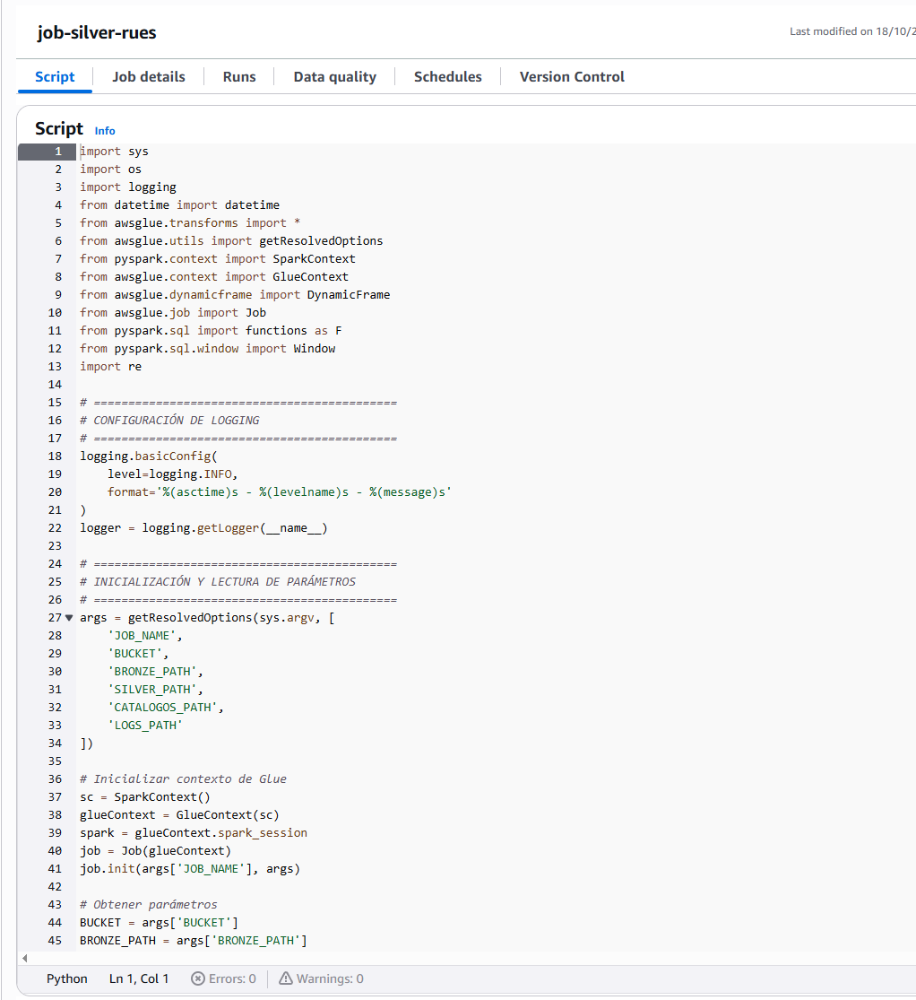

# Crawlear Capa Silver

## Paso 1: Acceder a AWS Glue

1. Acceda al servicio **AWS Glue** en la consola de AWS

2. En el menú lateral, seleccione **Crawlers**

3. Haga clic en **Create crawler**

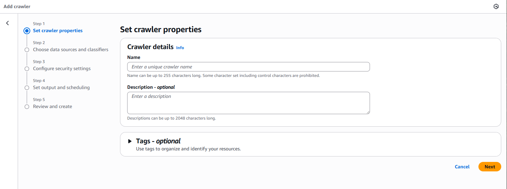

## Paso 2: Configurar las propiedades del Crawler

**Set crawler properties:**

1. **Name:** `crawler-silver-rues`

2. **Description (opcional):** `Crawler para catalogar datos procesados en la capa Silver`

3. **Tags:**
   - Clave: `workshop`
   - Valor: `big_data`

4. Haga clic en **Next**

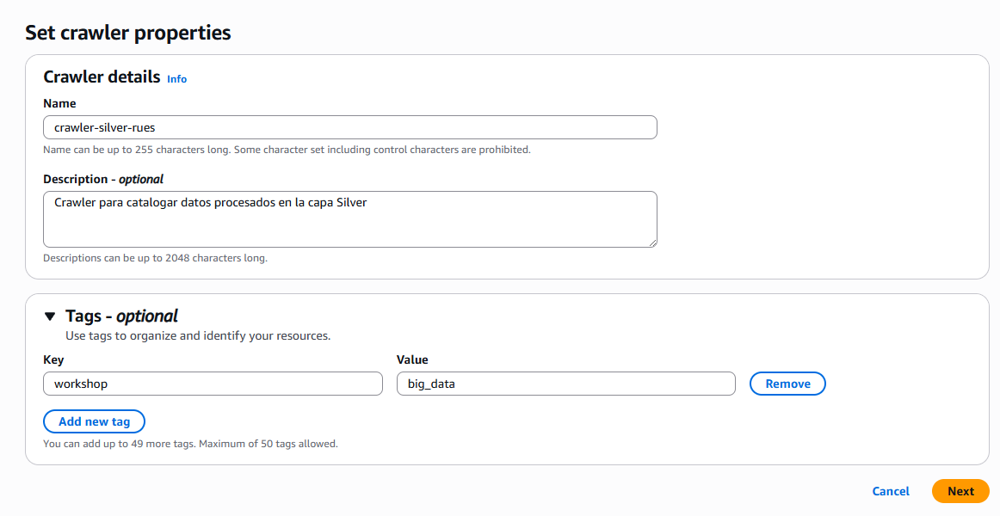

## Paso 3: Configurar el origen de datos

**Choose data sources and classifiers:**

1. Haga clic en **Add a data source**

2. Configure el data source:
   - **Data source:** S3
   - **S3 path:** `s3://glue-bucket-rues-{codigo}/silver/RUES_DATA_SILVER_PARQUET/`
   - **Subsequent crawler runs:** Crawl all sub-folders
   - Deje las demás opciones por defecto

3. Haga clic en **Add an S3 data source**

4. Haga clic en **Next**

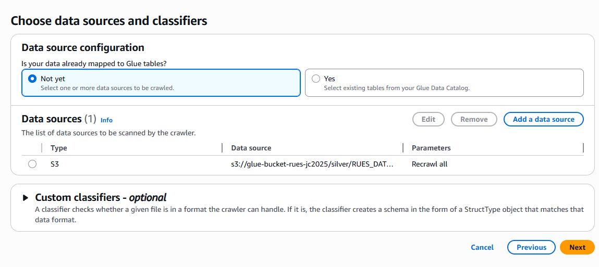

## Paso 4: Configurar el rol de IAM

**Configure security settings:**

1. **Existing IAM role:** Seleccione `GlueETLMedallionRole`

2. Haga clic en **Next**

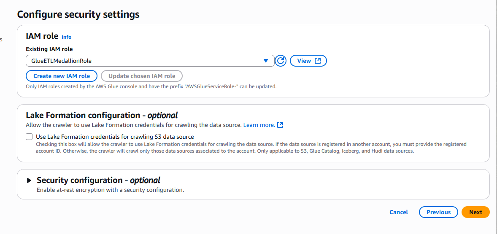

## Paso 5: Configurar el destino (Data Catalog)

**Set output and scheduling:**

1. **Target database:** Seleccione `db_rues`

2. **Table name prefix (opcional):** `silver_`

3. **Crawler schedule:**
   - **Frequency:** On demand

4. Haga clic en **Next**

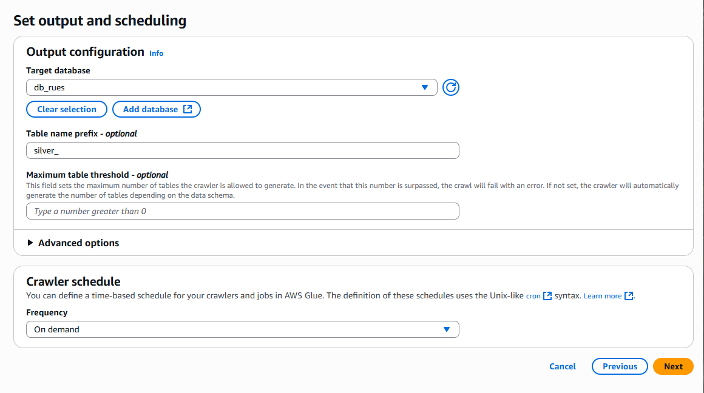

## Paso 6: Revisar y crear

**Review and create:**

1. Revise toda la configuración:
   - Nombre: `crawler-silver-rues`
   - Data source: `s3://glue-bucket-rues-{codigo}/silver/RUES_DATA_SILVER_PARQUET/`
   - IAM role: `GlueETLMedallionRole`
   - Target database: `db_rues`
   - Table prefix: `silver_`

2. Haga clic en **Create crawler**

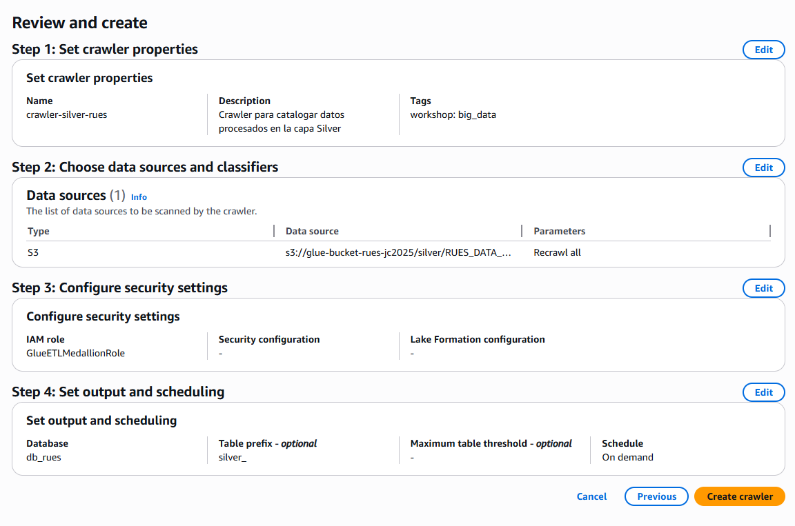

## Paso 7: Ejecutar el Crawler

1. En la lista de crawlers, seleccione `crawler-silver-rues`

2. Haga clic en **Run**

3. Espere a que el estado cambie de **Running** a **Ready**

4. Tiempo estimado: 1-2 minutos

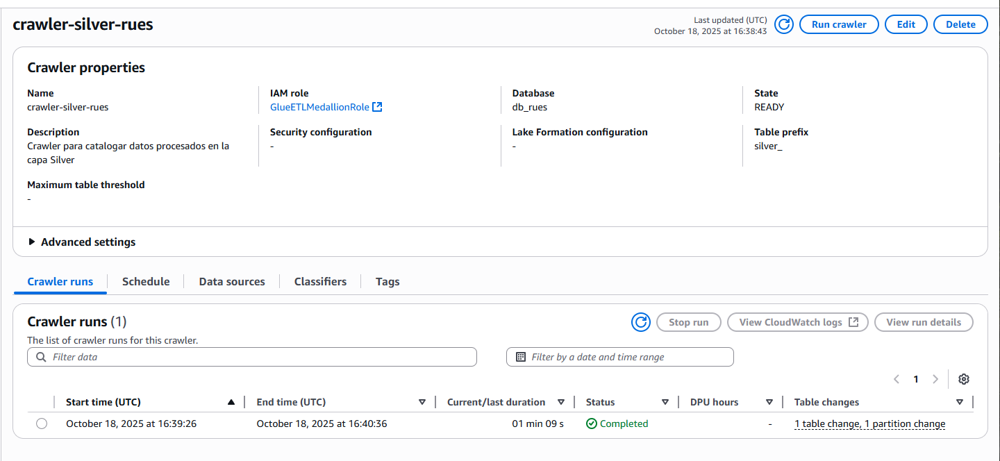

## Paso 8: Verificar la tabla creada

1. En AWS Glue, vaya a **Data Catalog** > **Tables**

2. Filtre por database: `db_rues`

3. Verifique que exista la tabla:
   - `silver_rues_data_silver_parquet`

4. Haga clic en la tabla para ver:
   - **Esquema:** Todas las columnas procesadas incluyendo campos derivados
   - **Partition keys:** `year_partition`
   - **Location:** Ruta en S3
   - **Classification:** parquet

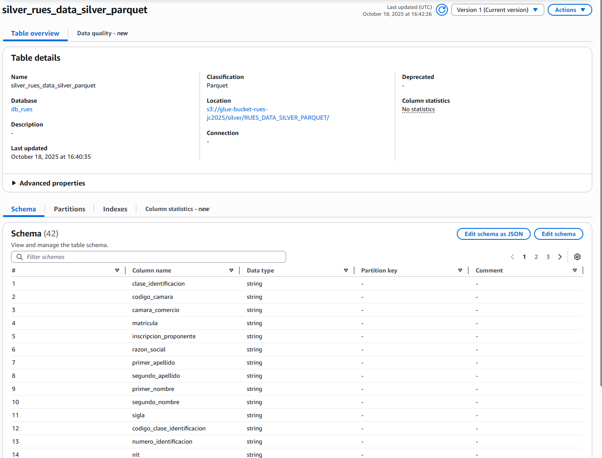